# 🌾 Berasku - AI Rice Variety Detection

> **Instant, Privacy-First Rice Classification using Edge AI.**

Berasku is a modern web application that uses **TensorFlow.js** to detect rice varieties (Jasmine, Basmati, IR64, etc.) directly in the browser. No images are uploaded to a server—inference happens 100% on the client side, ensuring zero latency and complete data privacy.


## ✨ Key Features

-   **⚡ Edge AI Inference**: Powered by a custom-trained **MobileNetV2** model running entirely in the browser via TensorFlow.js.
-   **🛡️ Smart "Bumper" System**: Implements a strict **80% Confidence Threshold** pre-check.
    -   Automatically analyzes image characteristics (saturation, brightness, texture) *before* classification.
    -   Rejects non-rice objects (e.g., selfes, landscapes, random objects) with specific error messages.
-   **🎨 Premium Monochrome UI**: A sleek, minimal **Black & White** aesthetic designed for clarity and professionalism.
-   **📱 Fully Responsive**: Optimized for desktop, tablet, and mobile devices.
-   **🚀 Instant Feedback**: Real-time analysis with visual confidence scores.

---

## 🏗️ Clean Architecture

The project follows a structured monorepo-style architecture to separate the frontend application from the machine learning assets.

```mermaid
graph TD
    Root[📂 Project Root] --> FE[📂 fe]
    Root --> Models[📂 tfjs_model]
    Root --> Config[📄 vercel.json / package.json]

    FE --> Components[📂 components]
    FE --> Pages[📂 pages]
    FE --> Utils[📂 utils]
    FE --> Public[📂 public]

    Utils --> Classifier[📂 riceClassifier]
    Classifier --> Logic[analysis.ts / model.ts]

    style Root fill:#f9f9f9,stroke:#333
    style FE fill:#e1f5fe,stroke:#01579b
    style Models fill:#fff3e0,stroke:#e65100
```



### Directory Structure

| Directory | Description |
| :--- | :--- |
| **`fe/`** | **Frontend Application**. Contains the React source code, Vite config, and UI components. This is the main application logic. |
| **`fe/src/utils/riceClassifier/`** | **Modular AI Logic**. Contains the refactored classifier logic (`model.ts`, `analysis.ts`, `validation.ts`) for better maintainability. |
| **`tfjs_model/`** | **ML Artifacts**. The raw converted TensorFlow.js model files (`model.json` and `.bin` shards). |
| **`vercel.json`** | **Deployment Config**. Orchestrates the Vercel build to output from the `fe` directory. |

---

## 🛠️ Tech Stack

-   **Core**: [React](https://react.dev/) + [Vite](https://vitejs.dev/)
-   **AI Engine**: [TensorFlow.js](https://www.tensorflow.org/js)
-   **Styling**: [Tailwind CSS](https://tailwindcss.com/)
-   **Animations**: [Framer Motion](https://www.framer.com/motion/)
-   **Icons**: [Lucide React](https://lucide.dev/)

---

## 🚀 Getting Started

### Prerequisites

-   Node.js (v18 or higher)
-   npm or bun

### Installation

1.  **Clone the repository**
    ```bash
    git clone https://github.com/otaruram/Berasku.git
    cd Berasku
    ```

2.  **Install Dependencies**
    ```bash
    cd fe
    npm install
    ```

3.  **Run Development Server**
    ```bash
    npm run dev
    ```
    The application will be available at `http://localhost:8080`.

---

## 🧠 How It Works

1.  **Image Input**: User drops an image or selects one from the gallery.
2.  **Pre-Analysis (The Bumper)**:
    -   The `calculateRiceLikelihood` function scans the image for "rice-like" features (texture variance, color consistency, brightness).
    -   If the **Rice Score** is < 80/100, the image is rejected immediately.
3.  **Inference**:
    -   If valid, the image is passed to the **MobileNetV2** model.
    -   The model returns probabilities for known classes (Jasmine, Basmati, etc.).
4.  **Result**: The highest confidence class is displayed to the user.

---

## 🤝 Contributing

Contributions are welcome! Please feel free to submit a Pull Request.

1.  Fork the Project
2.  Create your Feature Branch (`git checkout -b feature/AmazingFeature`)
3.  Commit your Changes (`git commit -m 'Add some AmazingFeature'`)
4.  Push to the Branch (`git push origin feature/AmazingFeature`)
5.  Open a Pull Request

---

## 📄 License

Distributed under the MIT License. See `LICENSE` for more information.

---

<div align="center">
  <p>Made with ❤️ by <strong>Berasku Team</strong></p>
  <a href="https://github.com/otaruram/Berasku">GitHub Repository</a>
</div>
